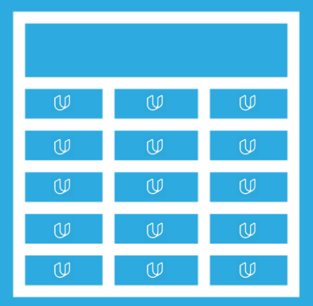
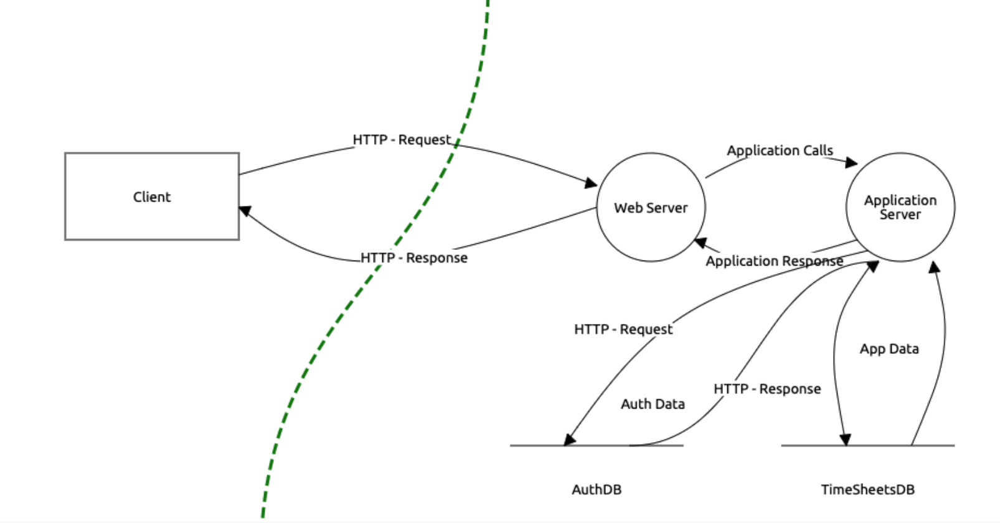

# TimeSheets Threat Model

An image of a spreadsheet with the Udacity logo in it.

### Scenario

Your company utilizes a custom application, called TimeSheets, to log timesheets. This custom application was built in-house. Until recently, this application was only accessible via the internal corporate network. Due to an increasingly mobile workforce, the need to access the application externally has started to increase. Business leaders made the suggestion of using the existing application and exposing it externally. Last week, IT made the change to allow users to connect externally.

Shortly after exposing TimeSheets externally, the IT and security operations teams began noticing odd behavior related to TimeSheets. IT has seen a significant amount of users reporting incorrect data in the system. The security operations center has noticed logins from unexpected locations and unexpected times. After raising an incident, it was determined that unauthorized logins were occurring.

After resolving the incident, your team was asked to come in and assess the application and provide recommendations. A senior security engineer from your team completed the initial threat model related to the incident. During the threat model, your colleague discovered the root cause for the incident as well as several other vulnerabilities - all of which are related to encryption. Due to other obligations, your colleague has asked you to complete their work.

### Your Project Submission

To successfully complete this project, you will need to complete a Threat Review document which will require the following:

1. Threat Model Review and complete a Threat Assessment.
2. Analysis of Vulnerabilities
3. Risk Analysis
4. Mitigation Plan

Your final report should be a ._pdf_ document with the name, _TimeSheets Threat Report.pdf_.

### Section 1: Initial Threat Assessment

You have been given an incomplete threat model.

* [Powerpoint Version of TimeSheets Threat Report](https://drive.google.com/file/d/1X3C-LDIkcmgXeRP8BWbGAlq_Ru20AKVc/view?usp=sharing)

* [Google Slides Version of TimeSheets Threat Report](https://docs.google.com/presentation/d/1GFJ9yAi2Zjg3OH9ZMl8wbwS98pn6unDaesy9K-z_ZAI/copy?usp=sharing)

The threat model lists a number of issues that have been discovered. Your first job is to analyze the partially completed threat report.

Your coworker completed several sections:

* An Asset Inventory
* An Initial Threat Model

* A Threat Analysis
* A Threat Actor Analysis

**Download the threat report and look over your coworker's observations.** You will use this information in the next sections and fill in your answers and observations in the Threat Report document.

### Section 2: Vulnerability Analysis 
Your coworker has listed each of the discovered vulnerabilities.

* Employee Data Unencrypted at Rest
* Authentication Data Stored Using Reversible Encryption
* Authentication Requests are Unencrypted in Transit
* DES Algorithm in Use

You need to explain why these are considered vulnerabilities. Make sure to include the potential consequences of a successful exploit.

_(Optional)_ **Stand Out Task**: 
Examine the threat model diagram from section one and identify any non-encryption related issues. What recommendation would you give to solve those issues, and why do you recommend those actions?

### Section 3: Risk Analysis

Rank each of the four identified encryption issues in order of severity:

* (1) being the most severe, and (4) being the least severe. 
 

* Explain your reasoning for the ranking. It may help to use a tool or specific methodology, but you must go a step further than just ranking based on the scoring and provide further reasoning. 

* You must provide justification for each ranking (i.e. why is this the highest/lowest relative to the others).

### Section 4: Mitigation Plan

Suggest remediation's for each of the vulnerabilities. Additionally, you must justify your mitigation plan. It is not sufficient to just specify a fix, you must explain why your recommended course of action will work.

To finish out the section, come up with recommendations for the audit team (i.e. what steps can the audit team take to ensure this issue doesn’t recur).

_Hint_: Does a policy exist? If not, how would you solve this? This will help ensure you solve the issues going forward.

_(Optional)_ Stand Out Tasks:

1. Examine the architecture diagram from section one. Create an architecture diagram that shows a secure system. Please provide an image of your proposed architecture.
 
2. What additional steps would you recommend to prevent the attack identified in section one as well as preventing future issues?
